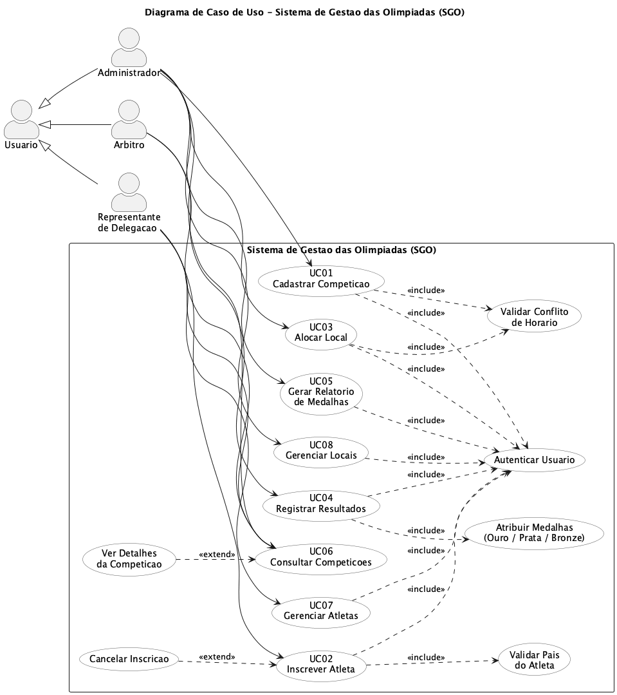
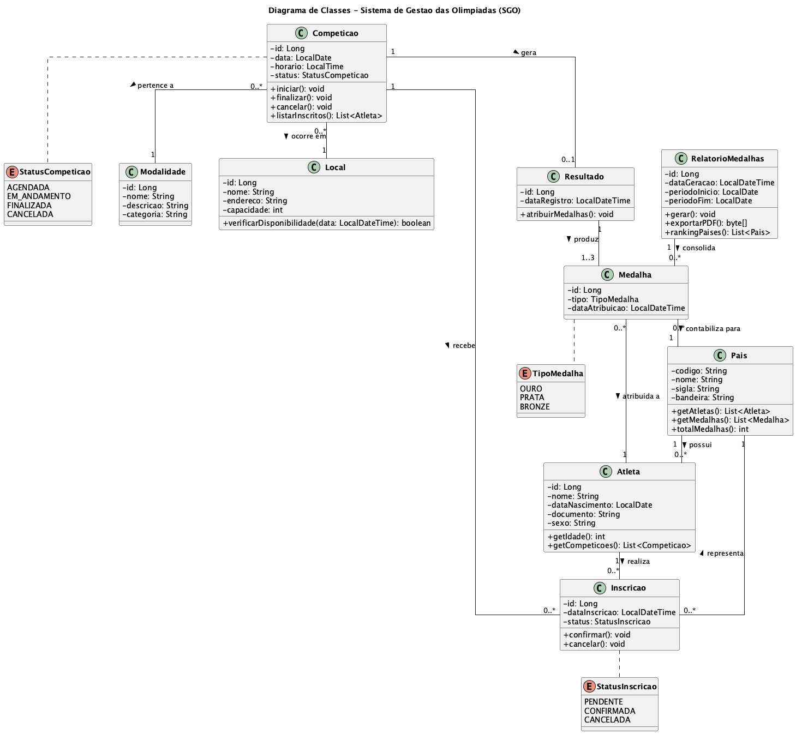
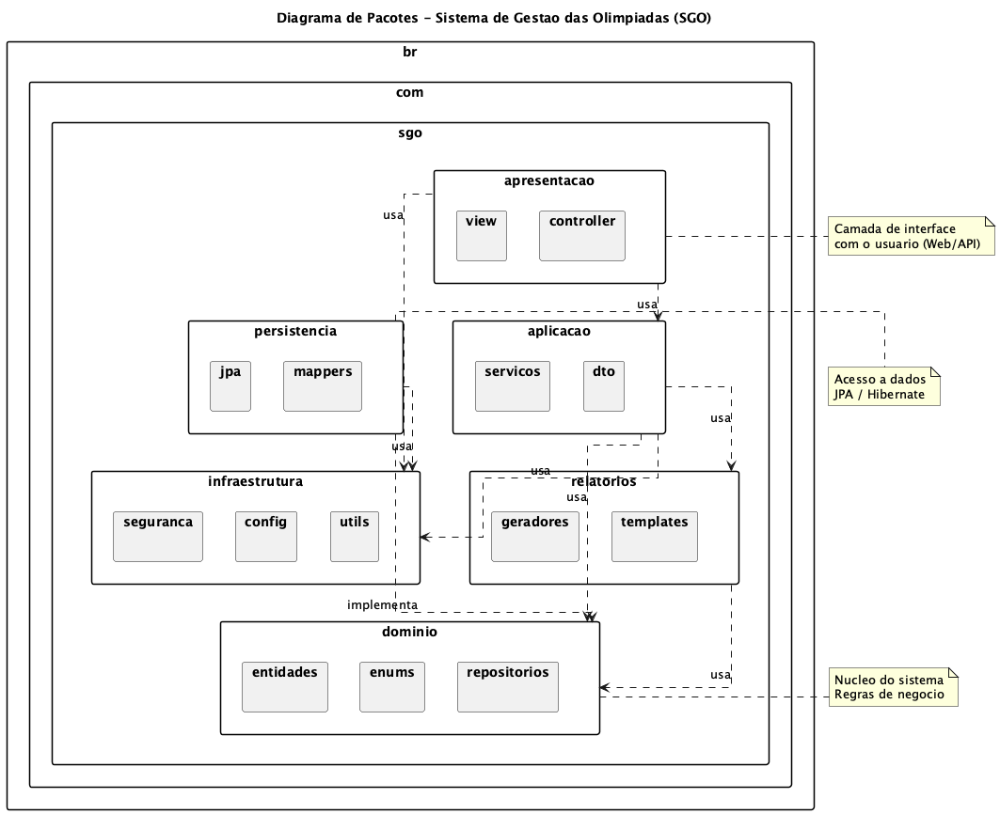
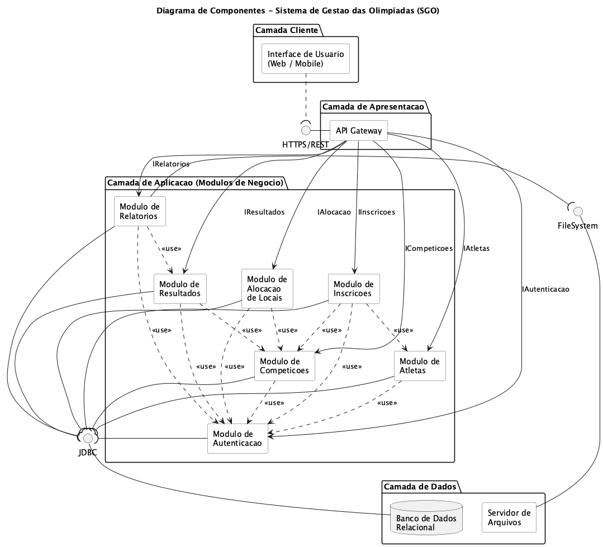
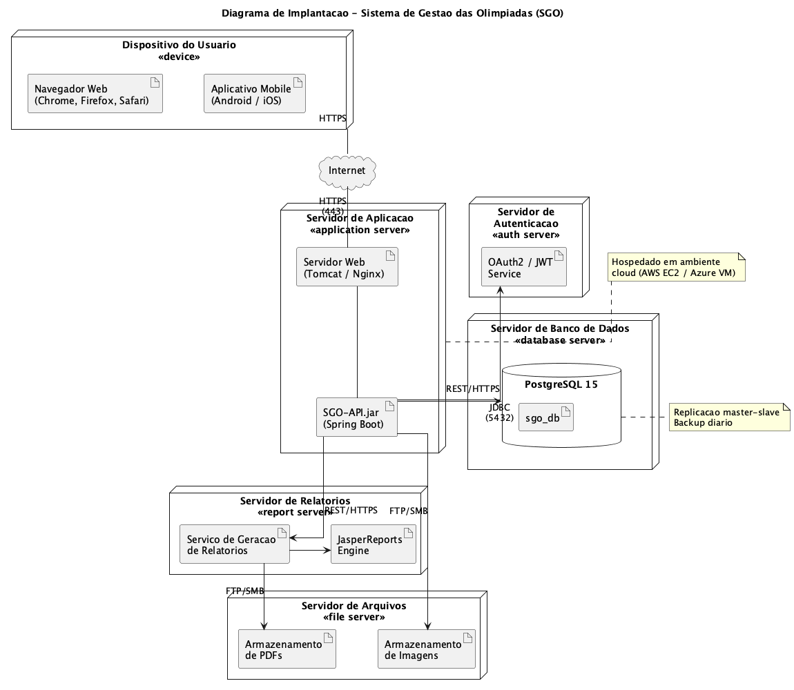

# Sistema de Gestão das Olimpíadas (SGO)

Sistema de gestão para coordenar os diferentes aspectos das Olimpíadas: gerenciamento de competições, inscrições de atletas, alocação de locais para as provas e controle de resultados.

## Disciplina

- **Curso:** Engenharia de Software
- **Disciplina:** Projeto de Software
- **Período:** 4º
- **Professor:** João Paulo Carneiro Aramuni
- **Instituição:** PUC Minas

## Descrição

Com a chegada das Olimpíadas, um novo sistema de gestão é necessário para coordenar os diferentes aspectos do evento. O SGO permite o cadastro de competições, inscrição de atletas de diferentes países, alocação de locais sem conflito de horário, registro de resultados e geração de relatórios de medalhas por país.

## Regras de Negócio

1. **Cadastro de competições** — cadastro com nome da modalidade, data, horário, local e lista de atletas inscritos.
2. **Inscrição de atletas** — atletas de diferentes países se inscrevem em competições específicas. Cada atleta pode participar de várias competições, mas só pode representar um país em cada modalidade.
3. **Alocação de locais** — locais alocados sem conflito de horário. Um local só pode abrigar uma competição por vez.
4. **Controle de resultados** — após a competição, registra-se o atleta vencedor e os classificados em segundo e terceiro lugar.
5. **Relatórios de medalhas** — gera relatório do desempenho de cada país com base nas medalhas de ouro, prata e bronze.

## Histórias de Usuário

### US01 — Cadastrar Competição
**Como** administrador do sistema,
**quero** cadastrar uma nova competição informando modalidade, data, horário, local e lista de atletas,
**para que** a competição fique disponível na agenda das Olimpíadas.

### US02 — Inscrever Atleta
**Como** representante de delegação,
**quero** inscrever um atleta em uma competição vinculado ao seu país,
**para que** ele possa participar da modalidade representando apenas um país por modalidade.

### US03 — Alocar Local
**Como** administrador do sistema,
**quero** alocar um local para uma competição em determinada data e horário,
**para que** não haja conflito de uso do mesmo local por duas competições simultâneas.

### US04 — Registrar Resultados
**Como** árbitro,
**quero** registrar o resultado de uma competição com o vencedor e os classificados em segundo e terceiro lugar,
**para que** as medalhas de ouro, prata e bronze sejam atribuídas aos atletas e seus países.

### US05 — Gerar Relatório de Medalhas
**Como** administrador do sistema,
**quero** gerar um relatório de medalhas por país,
**para que** o desempenho de cada delegação seja acompanhado durante o evento.

### US06 — Consultar Competições
**Como** usuário do sistema,
**quero** consultar a lista de competições agendadas com seus locais e horários,
**para que** eu possa acompanhar o calendário do evento.

### US07 — Gerenciar Atletas
**Como** representante de delegação,
**quero** cadastrar e manter os dados dos atletas do meu país,
**para que** eles possam ser inscritos nas competições.

### US08 — Gerenciar Locais
**Como** administrador do sistema,
**quero** cadastrar e manter os locais disponíveis para as competições,
**para que** possam ser alocados durante o planejamento das provas.

## Diagramas UML

### Diagrama de Caso de Uso



### Diagrama de Classes



### Diagrama de Pacotes



### Diagrama de Componentes



### Diagrama de Implantação



## Estrutura do Repositório

```
Trabalho-SGO/
├── README.md
├── imagens/
│   ├── diagrama-de-caso-de-uso.png
│   ├── diagrama-de-classes.png
│   ├── diagrama-de-pacotes.png
│   ├── diagrama-de-componentes.png
│   └── diagrama-de-implantacao.png
└── codigos/
    ├── diagrama-de-caso-de-uso.puml
    ├── diagrama-de-classes.puml
    ├── diagrama-de-pacotes.puml
    ├── diagrama-de-componentes.puml
    └── diagrama-de-implantacao.puml
```

## Tecnologia

Diagramas modelados em [PlantUML](https://plantuml.com/).

- Guia: <https://plantuml.com/guide>
- PlantUML API: <https://github.com/joaopauloaramuni/projeto-de-software/tree/main/PROJETOS/Python/Projeto%20PlantUML%20API>

## Autor

Arthur Miranda Sales
